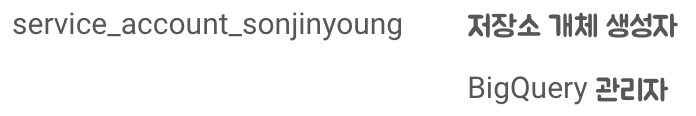
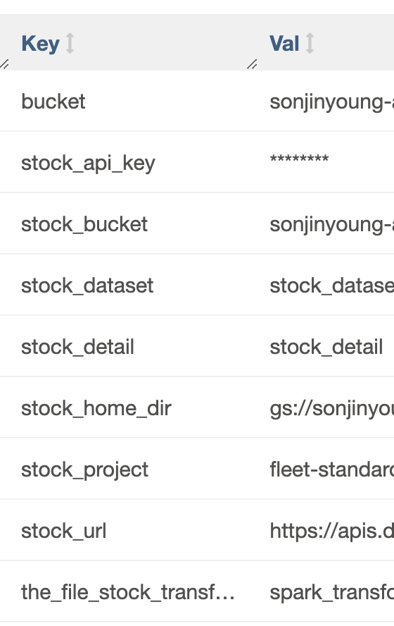

# DataPipeline

## Purpose of project
주식 데이터 분석 및 시계열 모델을 위한 DW 구축. 이를 위한 배치 파이프라인 구축 프로젝트를 목표.\
파이프라인은 Google Cloud Platform위에서 Batch로 Incremental하게 동작합니다.

## Process
1. Daily 스케쥴로 주식 데이터를 API를 활용해 로컬(Cloud Compute Engine)로 가져옵니다.
2. 가져온 데이터를 Cloud Dataproc(Spark/Hadoop)를 활용해 Transform을 수행합니다.
3. Transformed 된 결과를 GCS(Cloud Storage)에 저장한 후 BigQuery에 업데이트 합니다.\
3-1. 이때 파이프라인은 백필등의 작업에도 멱등성을 보장합니다.

## Architecture of Data Pipeline
Perspectives of movement of data

## Considerations
### IAM
1. Compute Engine에서 Google Cloud Storage내 리소스를 조회하고, 변경, 삭제 -> 개체 관리자
2. Compute Engine에서 BigQuery project 내 테이블 생성, 삭제, 변경. -> BigQuery 관리자\

### Service Account
[서비스 계정이란](https://www.notion.so/IAM-21def2538f424a89a173a6ea3abbb3ae?pvs=4#7ed255a943ee458bb0027123d9fa86bd)\
Compute Engine에서 Dataproc 등 다른 서비스를 API로 이용할 때 인증된 계정을 사용.\
Compute Engine에 대해 아래와 같은 서비스 계정을 생성해 API를 수행. 

### Others for Security
API Key 및 작업 환경 경로 등을 위해서 코드에 직접적으로 작성하기 보다 Variables나 Connections를 만들어 사용함.
1. Variables\

2. Connections\

### Cost
Dataproc 비용은 초 단위로 청구. 따라서 클러스터를 생성해 지속사용하는 것은 비용 낭비라고 생각함.\
위 파이프라인은 하루에 한 번 돌아가는 배치 형태이므로 매 DAG 실행마다 클러스터를 생성하고 삭제하는 형식으로 파이프라인이 동작.

### Schema
1. csv와 BigQuery간 데이터 타입 문제.\
csv는 컬럼 별 형식을 가지지 않기 때문에 string 형태와 data format 형태가 달라 문제 발생.\
이를 해결하기 위해 Json 형태의 Fixed된 스키마 형태를 사용했고 Date, Datetime, Time, Timestamp의 차이를 배웠음. (Refer/Schema에 정리)

2. BigQuery Performance 문제.\
하루에 약 300Kb가량의 적은 데이터이지만 매일 쌓이기 때문에 장기간 사용시 테이블의 크기가 매우 커질 수 있음.\
Clustering과 Partitioning을 활용해 해결. [Clustering과 Partitioning이란](https://www.notion.so/NoSQL-c714213918d84e17b0896f6d62b390d7?pvs=4#59d52765cd3c4f8dbcb1aab24468617f)

### Idempotency(멱등성)
Incremental Update(Daily)이므로 멱등성 보장이 필요.\
DW는 PK개념이 없기 때문에 다음과 같이 멱등성을 구현.
1. 기존 Origin 테이블을 tmp 테이블로 복사(Create Table As Select)
2. 새로운 데이터를 tmp 테이블로 업로드.
3. Window 함수를 사용해 가장 최근 업데이트 된 데이터만 추출해 원본 테이블을 업데이트.

## Final DAG

## BigQuery Partitioning & Clustering
Partitioning : 날짜 별로 파티셔닝을 하여 Incremental Update 시 데이터가 계속해서 증가해도 Performance를 보장.\
Clustering : 종목(KOSPI, KODAQ 등) 또는 기업 별 데이터 분석 및 시계열 모델 생성을 위해 데이터 추출에 있어 빠른 성능을 보장하기 위해 해당 필드를 기준으로 클러스터링 생성

## 업그레이드
- &#x2610; compute engine이 아닌 GKE를 활용
- &#x2610; GKE 오토 스케일링
- &#x2610; 리소스 모니터링 CA & PHA 사용방안 고민

&#x2610; &#x2611;
